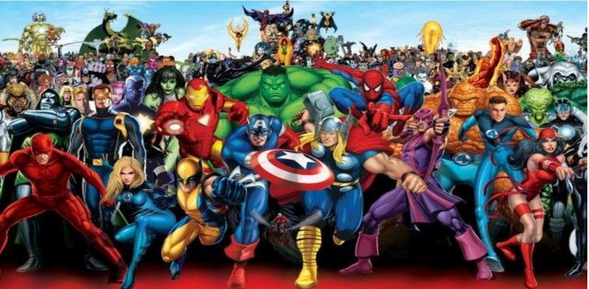
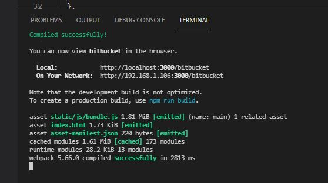
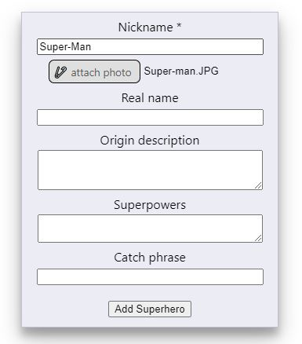
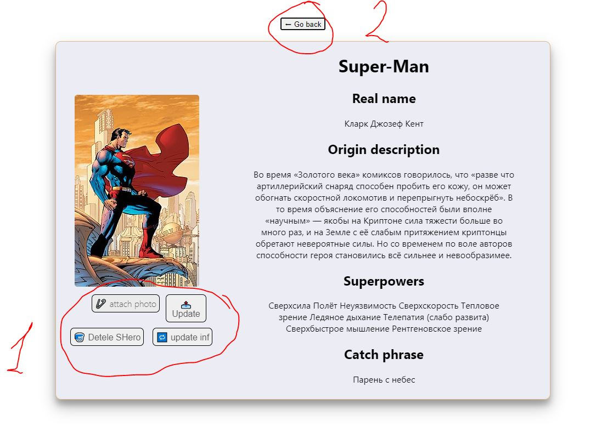

# JavaScript Engineer Test "Superheros"
 

### Front-End 
... was bootstrapped with [Create React App](https://github.com/facebook/create-react-app). 

The front-end was written in Rect.js with the use of auxiliary libraries:
"axios", "gh-pages", "react-dom", "react-router-dom", "slugify"
The use of Hooks and States made the task easier, for styling I used a modular connection with a style file.

### Back-End
... was bootstrapped with [Heroku](https://id.heroku.com/login) and files on gh-repository [Bitbucket-Node](https://github.com/Mishka31/bitbucket-node.git).

In my opinion, separating the backend and frontend into different repositories makes it easier and faster to work. At the same time, I refreshed my understanding of deploying and connecting to the Monoi DB database. No additional steps are required to launch the backend repository. The backend was written with Node/js and Express.js
CRUD technology was used to write the database

### Available Scripts in Front-End

### `npm start`
Runs the app in the development mode.\
Open [http://localhost:3000](http://localhost:3000) to view it in your browser.

### Launch step by step web application:

1. Open the project repository in the development environment application and enter the command "npm start" in the Terminal. After a successful launch, you will get the following output:

After that, you can use the application

2. The Superheroes application opens in front of you and you can already Create your Heroes without much difficulty.
Mandatory field is "Nickname" and attached photo. The photo should not exceed 2048 kilobytes:

After entering information about the Superhero, you need to click "Add Superhero". Under the form, you can immediately see the list of added superheroes.

3. You can remove a hero card immediately from the list by pressing the "Delete" button

4. To view the full information about the Superhero, you need to click on the hero card, in the new Route you will see a card with detailed information

5.  In the Hero card you can see all the information about the Superhero.

You also have the opportunity to change the photo, for this you should first attach the photo you have chosen by clicking the "attach photo" button, then click "upload"
By clicking the "update information" button, you can edit the information about the Superhero. From the same card, you can also remove the hero by clicking the "Delete Hero" button: "1" on screenShot

You can also go back by pressing the "go back" button "2" on screenShot

